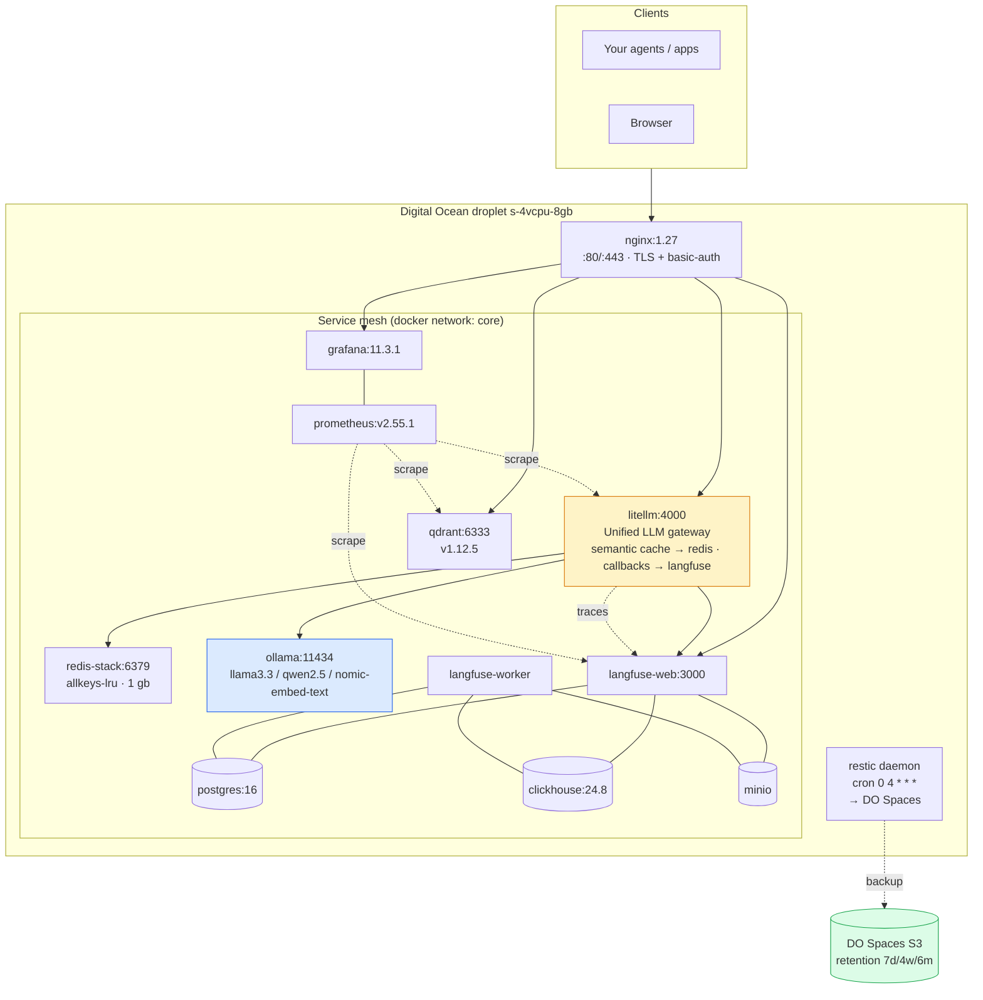
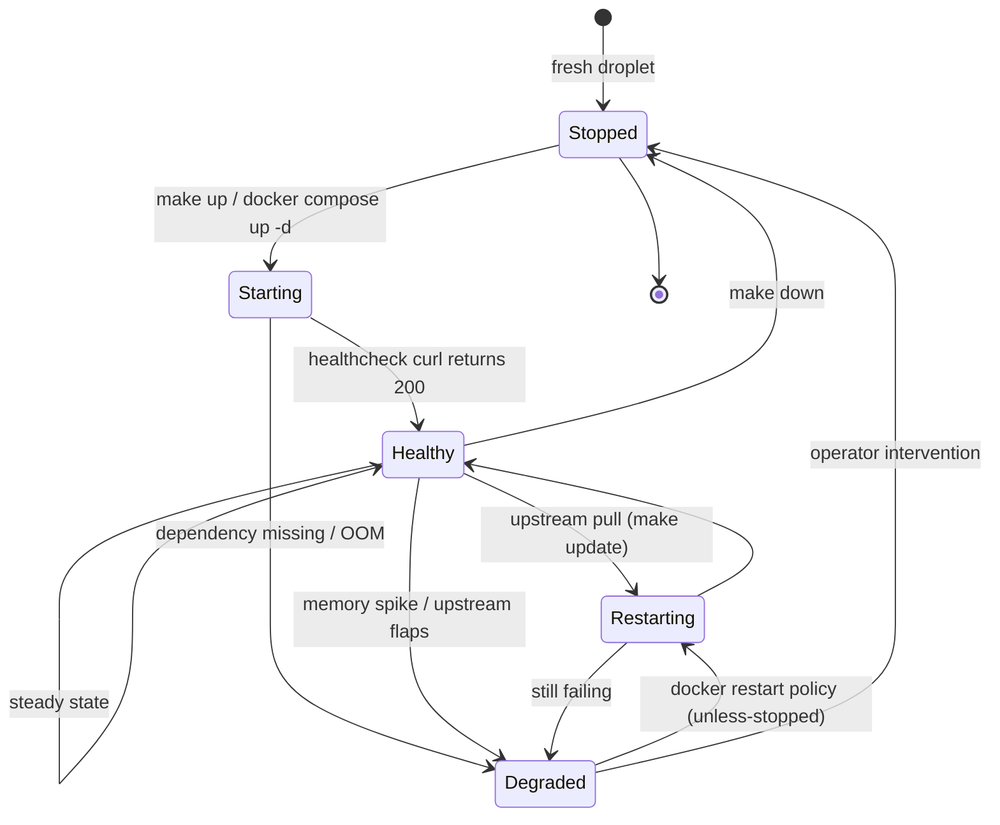
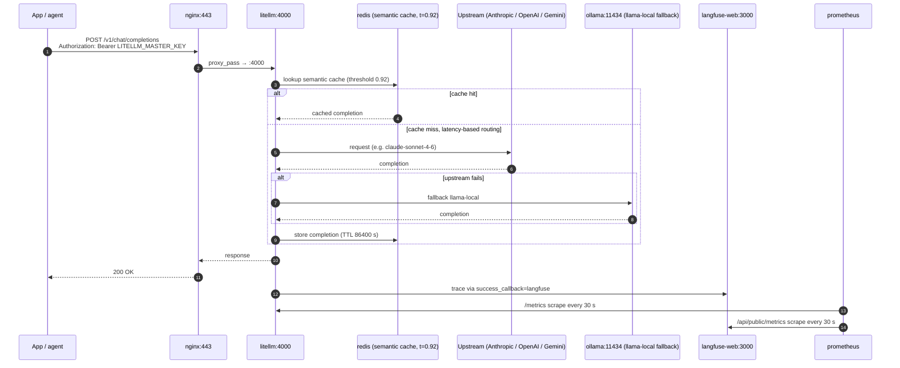

# ai-stack-do

[](LICENSE)
[](https://www.digitalocean.com)
[](https://docs.docker.com/compose/)
[](https://langfuse.com)
[](https://litellm.ai)
[](https://qdrant.tech)
[](https://ollama.com)

> **A production self-hosted AI stack on a single $40/month Digital Ocean droplet.** Qdrant + Langfuse v3 (web + worker + Postgres + ClickHouse + MinIO) + LiteLLM + Redis Stack + Ollama + nginx (TLS via certbot) + Prometheus + Grafana + Restic nightly backups to DO Spaces — all orchestrated by a single `docker-compose.yml` with tuned per-service memory limits.

Companion article: [Stack de IA self-hosted en un droplet de $40](https://numoru.com/en/contributions/stack-ia-self-hosted-digital-ocean).

---

## Why self-host

Managed LLM observability + vector DB + LLM gateway can easily run $300–$600 / month for a small team. For most Spanish-speaking SMB use cases, a **4 vCPU / 8 GB droplet ($40/month)** plus pass-through API keys is enough, keeps prompts on your infrastructure, and stays under EU/MX data-residency rules. This repo is the exact configuration Numoru runs in production.

---

## Self-hosted vs managed

| Concern | `ai-stack-do` | Managed SaaS equivalents |
|---|---|---|
| **LLM observability** | Langfuse v3 self-host (web + worker + PG + ClickHouse + MinIO) | Langfuse Cloud / Helicone (≈ 50–200 USD/mo after traffic) |
| **Vector DB** | Qdrant v1.12.5 | Pinecone / Qdrant Cloud (≈ 70 USD/mo small tier) |
| **LLM gateway** | LiteLLM with semantic cache via Redis | Portkey / OpenRouter (≈ 50 USD/mo) |
| **Metrics** | Prometheus + Grafana | Datadog starter (≈ 15 USD/host/mo) |
| **Backups** | Restic → DO Spaces (~5 USD/mo, 7 daily + 4 weekly + 6 monthly) | Provider snapshots (pricier at scale) |
| **Data residency** | Your droplet, your region | Vendor-dependent |
| **Marginal cost** | **~46 USD/mo base infra** | **400–600 USD/mo** |
| **Ops effort** | You own it | Vendor owns it |

---

## Stack components

| Service | Image (pinned) | Port | Purpose | Resource limit | Volume |
|---|---|---|---|---|---|
| `nginx` | `nginx:1.27-alpine` | 80/443 | Reverse proxy + TLS + nginx basic-auth in front of Qdrant | — | `./certs`, `./nginx/conf.d` |
| `qdrant` | `qdrant/qdrant:v1.12.5` | 6333 | Hybrid vector DB (dense + BM25 + reranker-ready) | 2 GB / 1.5 CPU | `qdrant_data` |
| `redis` | `redis/redis-stack-server:7.4.0-v1` | 6379 | Semantic cache for LiteLLM + working memory | 1.2 GB / 0.75 CPU | `redis_data` |
| `litellm` | `ghcr.io/berriai/litellm:main-stable` | 4000 | Unified OpenAI-compatible gateway (Claude / GPT / Gemini / Ollama) with Langfuse callbacks | 512 MB / 0.5 CPU | `./litellm/config.yaml` |
| `ollama` | `ollama/ollama:0.5.4` | 11434 | Local Llama 3.3 8B + Qwen 2.5 7B + `nomic-embed-text` (loaded on demand) | 5 GB / 2.5 CPU | `ollama_data` |
| `langfuse-db` | `postgres:16-alpine` | 5432 | Langfuse + LiteLLM metadata | 512 MB / 0.5 CPU | `lf_postgres` |
| `langfuse-clickhouse` | `clickhouse/clickhouse-server:24.8` | 8123 / 9000 | Langfuse analytics store | 1 GB / 1 CPU | `lf_clickhouse` |
| `langfuse-minio` | `minio/minio:RELEASE.2024-10-02T17-50-41Z` | 9000 / 9001 | Langfuse event uploads | 256 MB / 0.25 CPU | `lf_minio` |
| `langfuse-web` | `langfuse/langfuse:3` | 3000 | Langfuse UI (NextAuth) | 768 MB / 0.75 CPU | — |
| `langfuse-worker` | `langfuse/langfuse-worker:3` | — | Langfuse background processor | 512 MB / 0.5 CPU | — |
| `prometheus` | `prom/prometheus:v2.55.1` | 9090 | Scrapes Qdrant, LiteLLM, Langfuse | — | `prometheus_data` |
| `grafana` | `grafana/grafana:11.3.1` | 3000 (internal) | Dashboards | — | `grafana_data` |
| `restic` | `mazzolino/restic:1.7.3` | — | Daily `0 4 * * *` backups → DO Spaces (S3); retention 7d/4w/6m | — | all data volumes (ro) |

### Memory budget

| Service | Limit | Typical working set |
|---|---|---|
| Ollama | 5 GB | 0–4.8 GB (loaded on demand) |
| Qdrant | 2 GB | ~0.6 GB @ 1 M vectors |
| Redis | 1.2 GB | configurable (`allkeys-lru`) |
| ClickHouse | 1 GB | ~0.4 GB |
| Langfuse web + Postgres + worker + MinIO | 2.05 GB | — |
| Prometheus + Grafana + nginx | ~0.5 GB | — |
| **Committed** | **~11.3 GB** | **~6.5 GB typical** |

Fits `s-4vcpu-8gb` because Ollama is loaded on demand; if you pre-warm Llama 3.3 8B permanently, step up to `s-4vcpu-16gb`.

---

## Quick start

```bash
git clone https://github.com/numoru-ia/ai-stack-do.git
cd ai-stack-do
cp .env.example .env     # fill in every ${VAR} referenced below
make up
```

Point DNS at the droplet, then:

```bash
make certs         # certbot for api.* · langfuse.* · grafana.* · qdrant.*
make seed-ollama   # pulls llama3.3:8b-instruct-q4_K_M + qwen2.5 + nomic-embed-text
make health        # greps /readyz + /health on each service
```

### Make targets

| Target | What it does |
|---|---|
| `make up` | `docker compose up -d` |
| `make down` | `docker compose down` |
| `make logs` | Tail last 100 lines across all services |
| `make certs` | Let's Encrypt via `certbot/certbot` webroot mode; reloads nginx |
| `make seed-ollama` | `ollama pull` llama3.3 + qwen2.5 + nomic-embed-text |
| `make backup` | Trigger a Restic backup now |
| `make restore` | List snapshots; prints the restore command |
| `make health` | curl each service's healthcheck endpoint |
| `make update` | `docker compose pull && up -d` |

---

## Architecture



### Service lifecycle — state diagram



### A single LLM call through the stack — sequence



---

## LiteLLM configuration highlights (`litellm/config.yaml`)

| Concern | Value |
|---|---|
| Named models | `claude-sonnet` → `anthropic/claude-sonnet-4-6`, `claude-opus` → `anthropic/claude-opus-4-7`, `claude-haiku` → `anthropic/claude-haiku-4-5`, `gpt-4o`, `gpt-4o-mini`, `gemini-pro` → `gemini/gemini-2.0-pro`, `llama-local` → `ollama/llama3.3:8b-instruct-q4_K_M` |
| Cache | `type: redis-semantic`, `similarity_threshold: 0.92`, `ttl: 86400` |
| Callbacks | `success_callback: [langfuse]`, `failure_callback: [langfuse]` |
| Routing | `routing_strategy: latency-based-routing` |
| Fallbacks | `claude-sonnet → [gpt-4o, llama-local]`, `gpt-4o → [claude-sonnet, llama-local]`, `claude-opus → [claude-sonnet]`, `claude-haiku → [gpt-4o-mini, llama-local]` |
| Auth | `master_key` from `LITELLM_MASTER_KEY`; `DATABASE_URL` for virtual-key store |

---

## Observability

- **Langfuse v3**: every LiteLLM call emits a trace via the `success_callback`/`failure_callback` hooks. ClickHouse stores high-volume analytics; MinIO stores the raw event payloads; Postgres holds transactional metadata.
- **Prometheus**: scrape targets defined in `prometheus/prometheus.yml` — `qdrant:6333/metrics`, `litellm:4000/metrics`, `langfuse-web:3000/api/public/metrics`.
- **Grafana**: provisioning dir mounted from `./grafana/provisioning`; serves at `grafana.${DOMAIN}`.
- **health check**: `make health` is a one-liner — curls `/readyz` on Qdrant, `/health` on LiteLLM, `/api/public/health` on Langfuse, `/api/tags` on Ollama.

---

## Backups (Restic → DO Spaces)

The `restic` service mounts every data volume read-only and runs on a **`0 4 * * *`** cron. Repository is S3-compatible (`s3:${SPACES_ENDPOINT}/${SPACES_BUCKET}/restic`). Retention policy: `--keep-daily 7 --keep-weekly 4 --keep-monthly 6`.

```bash
make backup              # trigger now
make restore             # list snapshots; prints `docker compose run --rm restic restore <id> --target /`
```

---

## Security

- **TLS** via Let's Encrypt (`make certs`, certbot webroot).
- **nginx basic auth** in front of Qdrant's admin interface on top of Qdrant's own API key (`QDRANT__SERVICE__API_KEY`) — defence in depth.
- **Secrets** all come from `.env`; never committed. Rotate `LF_ENCRYPTION_KEY` quarterly.
- **Firewall**: only ports 80/443 public; everything else binds to the internal `core` network.
- **Postgres/ClickHouse/MinIO** are not exposed publicly; accessed only by Langfuse services over the internal network.

---

## DNS

```
A  api.yourdomain.com       → droplet_ip
A  langfuse.yourdomain.com  → droplet_ip
A  grafana.yourdomain.com   → droplet_ip
A  qdrant.yourdomain.com    → droplet_ip
```

## Configuration

All values pulled from `.env`. Non-exhaustive list (grep `docker-compose.yml` for the complete set):

| Env var | Required | Purpose |
|---|---|---|
| `DOMAIN` | ✅ | Base domain used for subdomains |
| `LITELLM_MASTER_KEY` | ✅ | LiteLLM auth token |
| `LF_DB_PASSWORD` | ✅ | Langfuse Postgres |
| `LF_CLICKHOUSE_PASSWORD` | ✅ | Langfuse ClickHouse |
| `LF_MINIO_PASSWORD` | ✅ | Langfuse MinIO root password |
| `LF_NEXTAUTH_SECRET` / `LF_SALT` / `LF_ENCRYPTION_KEY` | ✅ | Langfuse auth + at-rest encryption |
| `LF_PUBLIC_KEY` / `LF_SECRET_KEY` | ✅ | Langfuse project API keys used by LiteLLM callbacks |
| `REDIS_PASSWORD` | ✅ | `--requirepass` on Redis Stack |
| `ANTHROPIC_API_KEY` / `OPENAI_API_KEY` / `GEMINI_API_KEY` | per provider | Pass-through |
| `QDRANT_API_KEY` | ✅ | Qdrant service API key |
| `GRAFANA_PASSWORD` | ✅ | Grafana admin password |
| `SPACES_ENDPOINT` / `SPACES_BUCKET` / `SPACES_KEY` / `SPACES_SECRET` | ✅ | Restic target (DO Spaces) |
| `RESTIC_PASSWORD` | ✅ | Restic repository password |

---

## Cost

| Line item | USD / mo |
|---|---|
| Droplet `s-4vcpu-8gb` | 40 |
| Spaces (50 GB + egress) | 5 |
| Domain + certs | 1 |
| **Base infra** | **46** |

LLM API calls (Anthropic / OpenAI / Gemini) pass through and are billed separately. The LiteLLM semantic cache at `similarity_threshold=0.92` typically reduces repeat-prompt spend 40–60 %.

## Compliance notes

- **EU AI Act**: set Langfuse retention ≥ 6 months for systems qualifying as high-risk; enable ClickHouse column-level encryption for PII.
- **Data residency**: deploy in **FRA1/AMS1** (EU), **SFO3/NYC3** (US), or **TOR1** (Canada) per your jurisdiction.
- **GDPR / LFPDPPP**: rotate `LF_ENCRYPTION_KEY` quarterly; set Langfuse retention per subject-access-request policy.

## Terraform (optional)

`terraform/` provisions the droplet + Spaces bucket + floating IP. Apply with your DO token to spin up a fresh environment.

## Roadmap

- [ ] Ship the Grafana dashboards under `grafana/provisioning/dashboards/`.
- [ ] Add `ufw` and `fail2ban` hardening defaults.
- [ ] Optional SSO (OAuth proxy) in front of Grafana / Langfuse.
- [ ] GPU-droplet variant for Ollama at higher load.

## License

Apache 2.0 — see [LICENSE](LICENSE).
